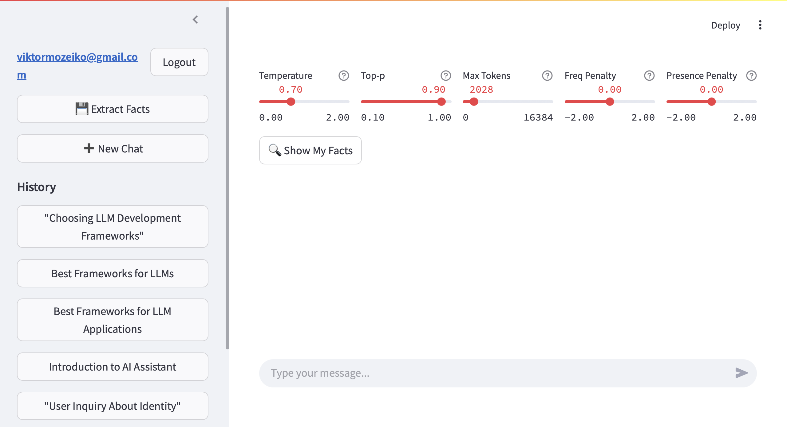

# ChatBot with Streamlit, LangChain, and Firebase

## Overview

This project is a conversational AI chatbot application built with Streamlit for the frontend, LangChain for AI capabilities, Firebase for user data storage, and Pinecone for vector-based long-term memory. The chatbot maintains conversation history and can recall relevant facts from previous interactions to provide context-aware responses.

## Features
* Interactive Chat Interface: User-friendly web interface built with Streamlit.
* GPT-4o-mini Integration.
* Dynamic LLM Tuning: Users can customize LLM parameters in real-time for personalized responses.
* Conversation Memory: Stores and retrieves past conversations for each user using Firebase.
* Long-term Context: 
    - Fact Extraction: LLM extracts user key facts from a conversation.
    - Pinecone Vector Store: Maintains relevant facts about the user in vector store for tailored responses.
* Authentication
    - Secure Login: Email/password via Firebase REST API
    - User Management:
        * Backend: Firebase Admin SDK (create/update users)
        * Metadata: Firestore stores last_login, preferences, and LLM settings

## Technology Stack
* Frontend: Streamlit
* AI Framework: LangChain
* AI model: gpt-4o-mini
* Database:
    * Firebase Firestore (user data and conversations)
    * Firebase (vector store for long-term memory)
* Authentication: Firebase Authentication

## Screenshots


## Installation

To run the app locally, follow these steps:

1. Clone the repository:
    ```sh
    git clone git@github.com:TuringCollegeSubmissions/azhurb-AE.2.5.git
    cd cd azhurb-AE.2.5/
    ```

2. Install Poetry (if you don't have it installed yet):
    ```sh
    curl -sSL https://install.python-poetry.org | python3 -
    ```
3. Install the required dependencies:
    ```sh
    poetry install

    ```
4. Activate the virtual environment:
    ```sh
    poetry env activate
    ```
5. Set up Firebase:
    * Create a Firebase project at Firebase Console
    * Download your service account JSON file, paste its contents as FIREBASE_CREDENTIALS into .streamlit/secrets.toml file
    * Enable Firestore Database and Authentication in your Firebase console
6. Set up environment variables
    ```sh
    OPENAI_API_KEY=your-api-key
    FIREBASE_PROJECT_ID=your_firebase_project_id
    PINECONE_API_KEY=your_api-key
    ```
7. Run the Streamlit app:
    ```sh
    streamlit run app.py
    ```